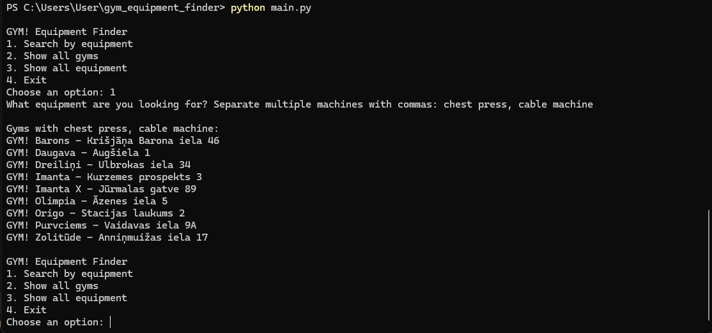

						GYM! Equipment Finder

A simple command-line Python program that helps users find GYM! locations in Riga based on the gym equipment they need.
The project was built as a beginner Python project to practice working with CSV files, functions, loops, user input, data filtering, and basic program structure.
Features
- Search for gyms by one piece of equipment
- Search for gyms that have multiple requested machines
- Case-insensitive and partial-name searching
- Show all gym locations and addresses
- Show all available equipment
- Handle empty searches and invalid menu choices
- Store gym and equipment data in CSV files

Example:

GYM! Equipment Finder
1. Search by equipment
2. Show all gyms
3. Show all equipment
4. Exit

Choose an option: 1
What equipment are you looking for? Separate multiple machines with commas: chest press, cable machine

Gyms with chest press, cable machine:
- GYM! Barons - Krišjāņa Barona iela 46
- GYM! Daugava - Augšiela 1
- GYM! Dreiliņi - Ulbrokas iela 34
...

## Screenshot

The program only returns a gym when it has all requested equipment.

		Project Structure:

gym-equipment-finder/
 main.py
 gyms.csv
 equipment.csv
 README.md

main.py
Contains the program logic and menu.

gyms.csv
Stores gym names and addresses.

equipment.csv
Stores the equipment available at each gym.

		How to Run

1. Make sure Python 3 is installed.
2. Download or clone this repository.
3. Keep main.py, gyms.csv, and equipment.csv in the same folder.
4. Open a terminal in that folder.
5. Run:	python main.py

	Search Behavior

Searches are case-insensitive.
For example:

CHEST PRESS 
and:
chest press

produce the same results.
Partial searches also work. For example:

chest
can match:
Chest Press

When multiple pieces of equipment are separated by commas, the program only returns gyms containing all of them.
Example:
chest press, cable machine

		What I Learned

While building this project, I practiced:
- Reading CSV files with Python's csv module
- Using csv.DictReader
- Splitting and cleaning strings
- Working with lists and sets
- Writing reusable functions
- Filtering data based on multiple conditions
- Handling user input
- Making searches case-insensitive
- Preventing empty input from producing incorrect results
- Organizing a small Python project into separate data and program files

			Possible Future Improvements

This version intentionally stays simple. Possible future versions could include:
- A graphical or web interface
- Fuzzy search and equipment aliases
- Filters for additional gym features
- Distance-based sorting
- More detailed gym information
- Automatic data updates

Version
V1.0
The goal of V1 was to build a small, complete, working Python program rather than an unfinished large project.

